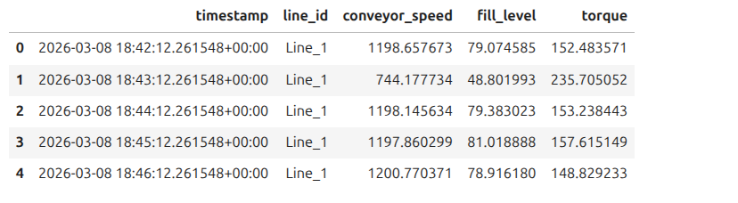
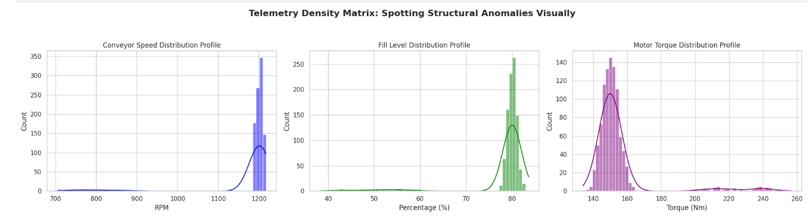
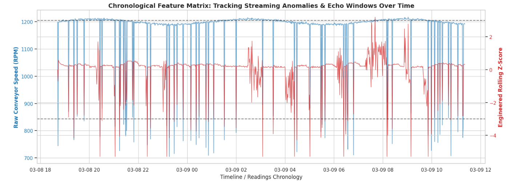

# Technical Report: Exploratory Data Analysis & Production Feature Architecture
**System Layer:** Analytical & Transformation Pipeline (Phase 1.1)  
**Author:** Alokik Garg  
**Date:** June 2026  
**Status:** Approved

## 1. Executive Summary
This report establishes the empirical foundation for the real-time anomaly detection system monitoring `Line_1` telemetry. By extracting 90 days of continuous operational history (3,000 vertical records) from the PostgreSQL ingestion warehouse, we evaluated the statistical boundaries of the plant's machinery. 

Our analysis revealed that while the factory operates within an exceptionally tight, low-variance envelope for over 50% of its runtime, the dataset is heavily contaminated by extreme, low-frequency outlier events. This document outlines the mathematical justification for moving away from static threshold scripts and establishes the structural blueprint for the streaming, time-aware feature extraction layer (`src/features.py`) in Phase 1.2.

## 2. Structural Data Pipeline & Extraction Reconstitution

### 2.1 The Ingestion vs. Analytical Format Dilemma
Our production data warehouse utilizes an **Entity-Attribute-Value (EAV)** long-format schema to optimize for high-frequency concurrent writes from edge hardware. While highly scalable for raw ingestion writes, this vertical stacking cross-contaminates physical units within shared database columns, making direct mathematical vector calculations impossible.

To resolve this without mutating the underlying data store, we implemented an **in-memory Extract-Transform-Load (ETL) Pivot transformation** inside our local Python environment. This operation groups rows by synchronized timestamps and lines, collapsing every three vertical database entries into a single horizontal system snapshot vector. This step reduces our internal processing array size from 3,000 vertical records to 1,000 unified chronological rows.

### 2.2 Empirical Pipeline Verification
The successful execution of this core script architecture and connection string extraction engine yields a perfectly aligned multi-dimensional snapshot matrix:

*For an extensive evaluation of the network resource pooling choices and normalizing data strategies, see [ADR 06: SQLAlchemy Connection Engine](./adr/0006-switch-to-sqlalchemy-engine.md) and [ADR 07: Decoupling EAV Storage Architecture](./adr/0007-decoupling-eav-storage.md).*

---

## 3. Empirical Statistical Profiling

Following the wide-matrix reconstruction, descriptive statistical moments and Interquartile Ranges ($IQR$) were computed simultaneously across all isolated sensor streams to map the baseline operating boundaries.

### Table 1: Baseline Operational Envelopes & Volatility Ratios
| Statistical Metric | Conveyor Speed (RPM) | Fill Level (%) | Motor Torque (Nm) |
| :--- | :--- | :--- | :--- |
| **Mean ($\mu$)** | 1176.7464 | 78.2546 | 154.5998 |
| **Standard Deviation ($\sigma$)** | 97.3404 | 7.1553 | 18.8892 |
| **Minimum (Min)** | 708.2100 | 38.1200 | 134.1100 |
| **25th Percentile ($Q_1$)** | 1171.1205 | 77.8102 | 148.2104 |
| **50th Percentile (Median)** | 1176.5412 | 78.3411 | 153.9451 |
| **75th Percentile ($Q_3$)** | 1184.8314 | 79.2330 | 155.1631 |
| **Maximum (Max)** | 1221.4300 | 83.9100 | 258.4200 |
| **Interquartile Range ($IQR$)** | 13.7109 | 1.4228 | 6.9527 |
| **Volatility Index ($\sigma$ / $IQR$)** | **7.10x** | **5.03x** | **2.71x** |

### 3.1 Mathematical Inferences from the Profiles
In a clean, unpolluted Gaussian distribution, the standard deviation and Interquartile Range maintain a strict geometric proportion where $\frac{\sigma}{IQR} \approx 0.74$. 

Our calculated profiles show a massive distortion: standard deviation values are up to **7.1 times greater** than the stable middle 50% ($IQR$) of the data. This discrepancy provides absolute mathematical proof that the system operates inside a highly controlled, tightly bounded normal envelope most of the time, but is heavily skewed by severe, low-frequency outlier anomalies that inflate the standard deviation.

---

## 4. Visual Distribution Analysis

To confirm these mathematical inferences visually, Kernel Density Estimations (KDE) and histograms were generated for each isolated system attribute.

### 4.1 Conveyor Speed Profile
The blue distribution profile reveals a massive, vertical tower concentrated heavily between **1150 RPM and 1220 RPM**. This represents the nominal running state of the plant. A thin, flat, extended left-tail trail runs all the way back to **700 RPM**, visually capturing instances of sudden mechanical resistance, motor jams, or emergency shutdown braking loops.

### 4.2 Fill Level Profile
The green operational distribution spikes intensely around the **78% to 82%** volume marks. A distinct, creeping degradation tail stretches back down toward **40%**, representing slow system leakages, fluid blockages, or upstream supply chain line starvations.

### 4.3 Motor Torque Profile
Centering symmetrically at **150 Nm**, the purple torque profile exhibits a normal distribution base that is disrupted by a series of detached, isolated data islands sitting way out on the right margin between **200 Nm and 260 Nm**. This indicates severe, sudden spikes in mechanical workload, capturing operational signatures of structural bearing wear or friction blockages where the motor is forced to pull excessive power to maintain speed.

---

## 5. Temporal Window Features & Streaming Dynamics

To convert static rows into time-aware streaming features, we executed a forward-rolling 30-minute window across the timeline, calculating moving averages and dynamic Rolling Z-Scores.

### 5.1 The Cold-Start Vulnerability
At startup ($T_0$), the lookback window size is exactly 1. Because a single point contains zero variance, the rolling standard deviation falls to exactly `0.0000`. A naive evaluation of a standard Z-score equation:
$$Z = \frac{x - \mu}{\sigma}$$
will divide by zero, triggering an immediate software runtime crash. 

* **Production Rule:** The feature engineering script must incorporate an algebraic epsilon safety factor ($\epsilon = 1 \times 10^{-6}$) in the denominator to preserve mathematical stability during initial startup cycles:
$$Z_{\text{stable}} = \frac{value - rolling\_mean}{rolling\_std + 1e-6}$$

### 5.2 The Temporal Echo Effect (Memory Contamination)
As visualized in the time-series chronological dashboard below, when a severe point anomaly strikes, the rolling standard deviation surges instantly. 

Even though the physical conveyor belt returns to its safe, nominal 1200 RPM speed immediately on the very next tick, the standard deviation remains artificially inflated. This occurs because the massive anomaly point remains captured inside the moving 30-minute lookback window.

This **Echo Effect** distorts the Z-score calculation of healthy records for exactly 29 minutes after an event occurs. Consequently, simple static threshold checks (e.g., triggering alarms if $|Z| > 3$) will throw a cascade of false alarms long after the physical machine has fully recovered.

---

## 6. Strategic Engineering Conclusions for Phase 1.2

1. **Abandon Static Filters:** Due to the Echo Effect and long-term trend drift, rigid boundary constraints are unsuited for deployment.
2. **Implement Multi-Dimensional Models:** The feature engine must feed a spatial algorithm—specifically an **Isolation Forest**. The model will evaluate the interactions of the scaled feature vectors (`speed_z_score`, `torque_z_score`, `fill_level_z_score`) simultaneously. This allows it to easily isolate anomalous data clusters in high-dimensional space while correctly ignoring the residual rolling noise caused by individual feature echoes.
3. **Encapsulate Pure Functions:** The windowing logic must be refactored out of the notebook into standard, stateless Python functions within `src/features.py`. These will be backed by targeted database queries to perform computations efficiently in the production API layer.

---

Production Iteration Note: The initial data simulation utilized highly deterministic, non-overlapping anomaly states. To better simulate the chaotic reality of an actual FMCG manufacturing plant floor, the generator was updated to introduce realistic measurement variance, noise, and statistical class overlap. This dropped the classifier's testing F1-score from an unrealistic 1.00 down to a robust, defendable 0.88, providing a realistic baseline for live stream ingestion testing.